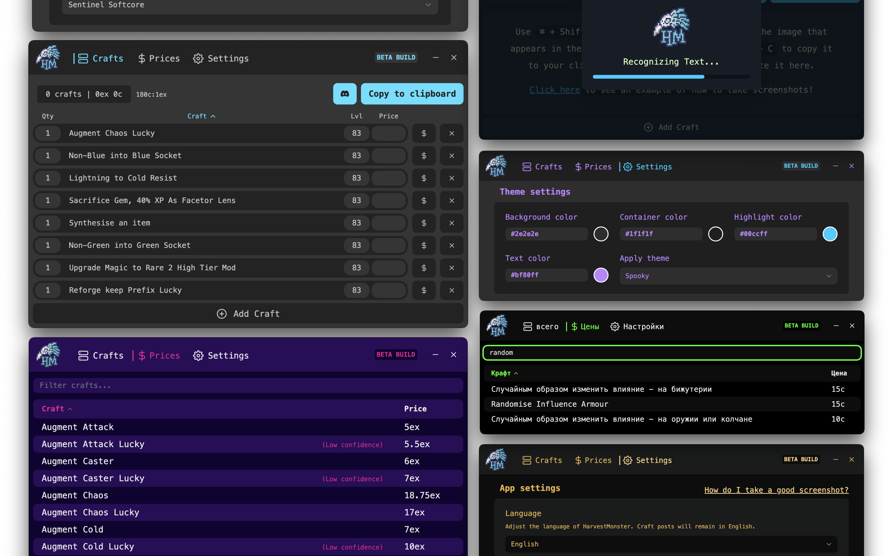

**As of the Path of Exile 3.19: Lake of Kalandra update, HarvestMonster no longers serves a purpose and is thus deprecated.** Thank you for your support and feedback!

# HarvestMonster (Beta)

HarvestMonster is a [Path of Exile](https://www.pathofexile.com/) Harvest craft management tool that helps you sell crafts on [The Forbidden Trove](https://forbiddentrove.com/). It is built on [Electron](https://www.electronjs.org/) with [Svelte](https://svelte.dev/), [JavaScript](https://developer.mozilla.org/en-US/docs/Web/JavaScript), [TypeScript](https://www.typescriptlang.org/), [Vite](https://vitejs.dev/), and [Tailwind](https://tailwindcss.com/).

    

## About HarvestMonster

HarvestMonster drew inspiration from [HarvestVendor by Esge](https://github.com/esge/PoE-HarvestVendor) and the popular [HarvestVendor fork by Stregon](https://github.com/Stregon/PoE-HarvestVendor). The purpose of this tool is to quickly convert the Harvest crafts in your Horticrafting Station into text that can be used in Discord to advertise them for sale.

Some of the unique features HarvestMonster includes are:

* 💱 **Automatic price adjustments:** exalt-to-chaos currency conversions and craft prices are regularly fetched, resulting in crafts that are always priced at the current market rate.
* 🔼 **Sortable crafts:** crafts can be sorted with a primary and secondary sort, so you stay in control of how crafts are presented in the app and in your listings.
* 🧠 **Craft autocompletion:** upon manually entering crafts, you'll receive locale-specific autocomplete recommendations which insert the English TFT craft identifier for you.
* 🏃‍♀️ **Share posts quickly:** click the Discord button, or enable auto-open Discord on copy in your settings, to quickly open the correct TFT Harvest trading channel for your league.
* 💰 **Price catalog**: browse, filter, and sort all of the TFT crafts right inside the app to help you quickly identify which crafts are worth storing.
* 🎨 **Preset and customizable themes:** choose from over a dozen preset themes, adjust one to your liking, or supply your own colors to make the tool fit your style and preference.
* 🌐 **Language support:** the beta version of our tool ships with basic translations for half-a-dozen languages, including Spanish, Japanese, Korean, Portuguese, Russian, and Simplified Chinese.
* 🖥️ **Support for all major platforms:** whether you play on Windows, your favorite flavor of Linux, or on Mac via cloud gaming or the native installer, HarvestMonster aims to work for you. This tool is actively developed on both Windows and Mac and is tested on Linux regularly.
* 🌟 **And much more** including the features you've come to expect in a tool like this, such as: support for multiple leagues, copying craft listings to your clipboard, and automatic updates delivered without needing to redownload.

## Download, Install, and Setup

It is recommended that you [visit our website](https://www.harvestmonster.com) which provides clear instruction on how to download, install, and use HarvestMonster. If you're comfortable using GitHub and understand which package is right for you, read ahead:

### Latest Stable

You can always find the latest stable build of HarvestMonster on [the latest release page](https://github.com/ryanbarr/harvest-monster/releases/latest):

1. Look for the most recent release with the green "Latest" badge (hint: it should be at the top!)
2. Expand the "Assets" section if it is not already open.
3. Download the installer that is right for your operating system:

#### Identifying the right download

  * **For Windows:** download the latest `.exe` installer.
  * **For Mac:** download the latest `.dmg` installer.
  * **For Linux:** depending on your architecutre, download either the latest `.deb` or `.AppImage` package.

### Automatic Updates

HarvestMonster attempts to apply updates automatically in the background. If an update is available that isn't automatically applied, you will see an `Update Available` banner in the titlebar of the application.

## Roadmap

First and foremost, this is a passion project built with the intent to meet three specific needs:

1. A non-intrusive way to quickly convert in-game crafts to an organized list of sellable crafts.
2. An efficient way to list crafts for sale and update their status when sold.
3. A way to deliver quality-of-life enhancements to keep the player's focus on playing the game.

With that in mind, there are a handful of features and enhancements that should be considered in the future. Features being actively considered, discussed, and planned can be found [in the discussions section](https://github.com/ryanbarr/harvest-monster/discussions). Here are a few broad examples for enhancements and feature additions that may be considered:

* Application performance improvements, such as moving Tesseract into a web worker and instantiating it on initial load.
* Improved OCR configuration and training, such as supplying a character whitelist or experimenting with page segmentation modes.
* Enhanced support for Mac and Linux platforms, such as drag and drop support for screenshots.
* Potential community-focused features, such as a willing-to-buy section or player blacklist integration.
* New features that increase scope, such as sales history/statistics or support for bench crafts and player services.

## Contributions

HarvestMonster was built for the greater community and as such only gains to benefit from contributions from that same community. There are a number of ways that you can make an impact on HarvestMonster.

### Feedback, Feature Requests, and Bug Reports

* In the event you encounter a bug, strange behavior, or broken functionality please [submit a new issue](https://github.com/ryanbarr/harvest-monster/issues/new?&labels=bug&template=bug_report.md) on our issue tracker.
* If you have feedback to share or ideas you would like to propose, please [create a new discussion](https://github.com/ryanbarr/harvest-monster/discussions) on in our Discussion section.

### Translations

In some cases, our translations may be provided from generators such as [Google Translate](https://translate.google.com/). While these allow us to more quickly include members of the community who prefer languages other than English, the translations produced often fall short. This is often due to a loss of context, tone, or inflection and results in a jarring experience for our users.

* If you'd like to submit a correction for an existing language, please [open a bug report](https://github.com/ryanbarr/harvest-monster/issues/new?&labels=bug&template=bug_report.md) and detail the text that needs to change with your correction.
* If you're interested in supplying translations for a language that is not yet supported, please [create a new discussion](https://github.com/ryanbarr/harvest-monster/discussions) and note the language you'd like to work on.
* If you would like to do either of the tasks above and are comfortable working directly with `JSON` files, feel free to read our [Contributing Guide](CONTRIBUTING.md) and open a Pull Request.

### Development

See the [Contributing Guide](CONTRIBUTING.md) for information on how to help build HarvestMonster. Please consider also [reading the Wiki](https://github.com/ryanbarr/harvest-monster/wiki) which details some of our architectural considerations and additional context that you may find useful while working in the repository.
